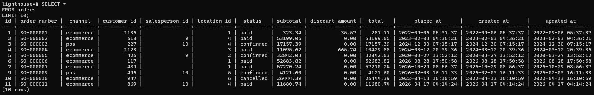
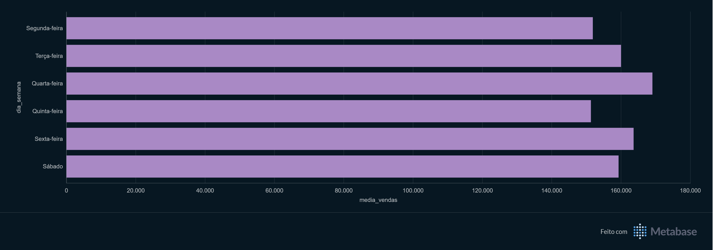

# LH Nautical - Projeto de Engenharia de Dados

## Objetivo

Este projeto foi desenvolvido durante a formação em Engenharia de Dados com o objetivo de trabalhar com dados provenientes de arquivos CSV de um sistema ERP.

O projeto envolve a criação do schema do banco, carregamento dos dados, consultas SQL e análise dos resultados através do Metabase.

Durante o desenvolvimento foram praticados conceitos como:

- Python
- PostgreSQL
- SQL
- Docker
- Metabase
- ETL
- Git e GitHub
- Análise de dados

---

## Arquitetura do Projeto

```text
Arquivos CSV
     ↓
   Python
     ↓
 PostgreSQL
     ↓
    SQL
     ↓
  Metabase
     ↓
Dashboards
```

---

## Tecnologias Utilizadas

### Linguagem

- Python 3.12

### Banco de Dados

- PostgreSQL 16

### Containers

- Docker

### Análise e Visualização

- SQL
- Metabase

### Versionamento

- Git
- GitHub

---

## Estrutura do Projeto

```text
lh-nautical-data-engineering/

├── sql/
│   ├── questao_4_1.sql
│   └── questao_5_1.sql
│
├── docs/
│    ├── postgresql-query.png
│    ├── metabase-dashboard.png
│    └── analise-fornecedores.pdf
│
├── schema.py
├── schema.sql
├── load.py
├── .gitignore
└── README.md
```

---

# Etapas do Projeto

## 1. Preparação da Infraestrutura

Para execução do projeto foi utilizado Docker para disponibilizar os serviços necessários.

### PostgreSQL

O PostgreSQL foi executado utilizando Docker.

```bash
docker run -d \
  --name postgres-lighthouse \
  -e POSTGRES_DB=lighthouse \
  -e POSTGRES_USER=**** \
  -e POSTGRES_PASSWORD=**** \
  -p 5432:5432 \
  postgres:16
```

Verificar se o container está em execução:

```bash
docker ps
```

Acessar o banco:

```bash
docker exec -it postgres-lighthouse \
psql -U postgres -d lighthouse
```

### Metabase

O Metabase foi executado utilizando Docker e conectado posteriormente ao banco PostgreSQL.

```bash
docker run -d \
--name metabase \
-p 3000:3000 \
metabase/metabase:latest
```

Após a inicialização dos containers, o ambiente estava preparado para receber os dados e realizar as análises.

---

## 2. Desenvolvimento em Python

Foi desenvolvido um script em Python para realizar a leitura dos arquivos CSV e identificar suas colunas.

A partir dessas informações foi gerado automaticamente o arquivo:

```text
schema.sql
```

Script utilizado:

```text
schema.py
```

Também foi desenvolvido um segundo script responsável por realizar a carga dos dados.

Esse script realiza a leitura dos arquivos CSV e insere os registros nas respectivas tabelas do PostgreSQL.

Script utilizado:

```text
load.py
```

O processo de carregamento foi realizado utilizando Python e PostgreSQL.

---

## 3. Criação do Banco e Validação dos Dados

Após gerar o arquivo `schema.sql`, foi realizado o carregamento da estrutura das tabelas no PostgreSQL através do comando:

```bash
docker exec -i postgres-lighthouse psql -U postgres -d lighthouse < schema.sql
```

Esse arquivo contém todos os comandos SQL necessários para criação das tabelas utilizadas no projeto.

Após a criação das tabelas, foi executado o script de carga dos dados.

Em seguida, os dados foram validados diretamente no PostgreSQL através do terminal Linux.

Exemplo:

```sql
SELECT *
FROM orders
LIMIT 10;
```

### Consulta executada no PostgreSQL



---

## 4. Criação das Consultas e Dashboards no Metabase

Após o carregamento e validação dos dados, o Metabase foi conectado ao banco PostgreSQL `lighthouse`.

A ferramenta foi utilizada para realizar consultas SQL e construir visualizações analíticas.

### Análise de Clientes

Foram realizadas consultas SQL para identificar clientes com maior ticket médio e maior diversidade de categorias.

A análise considera:

- Faturamento total por cliente
- Frequência de compras
- Ticket médio
- Diversidade de categorias
- Top 10 clientes

Para a análise foram considerados clientes que compraram produtos de pelo menos 13 categorias diferentes.

---

### Dimensão de Calendário

Foi criada uma dimensão de calendário utilizando SQL.

O objetivo foi considerar todas as datas do período analisado, inclusive os dias em que não houve nenhuma venda.

Os dias sem vendas foram considerados como:

```text
R$ 0,00
```

A análise considera somente as vendas realizadas em lojas físicas:

```text
channel = 'pos'
```

Essa abordagem evita que dias sem vendas sejam ignorados no cálculo da média.

---

### Dashboard



### Relatório PDF


---

## Principais Conceitos Praticados

Durante o desenvolvimento deste projeto foram praticados:

- Leitura de arquivos CSV
- Ingestão de dados
- Criação de schemas
- Python
- PostgreSQL
- SQL
- JOIN
- CTE
- GROUP BY
- Funções de agregação
- Dimensão de calendário
- Docker
- Metabase
- Git
- GitHub

---

## O que Aprendi com este Projeto

Durante o desenvolvimento deste projeto aprendi:

- Como trabalhar com arquivos CSV como fonte de dados.
- Como utilizar Python para automatizar o carregamento dos dados.
- Como criar tabelas PostgreSQL a partir de arquivos CSV.
- Como realizar análises utilizando SQL.
- Como utilizar JOINs para relacionar diferentes tabelas.
- Como trabalhar com uma dimensão de calendário.
- Como considerar dias sem vendas em análises.
- Como utilizar Docker para disponibilizar o PostgreSQL e o Metabase.
- Como criar consultas e visualizações utilizando o Metabase.
- Como organizar e versionar um projeto utilizando Git e GitHub.

---

## Próximos Passos

Pretendo evoluir este projeto adicionando:

- Automatização do processo de ingestão
- Logs de execução
- Variáveis de ambiente
- Apache Airflow
- DBT
- Data Warehouse
- Novos dashboards
- Melhorias nas análises SQL

---

## Autor

**Leandro Soares**

Projeto desenvolvido para estudos e evolução na área de Engenharia de Dados, atendendo ao programa Lighthouse.
